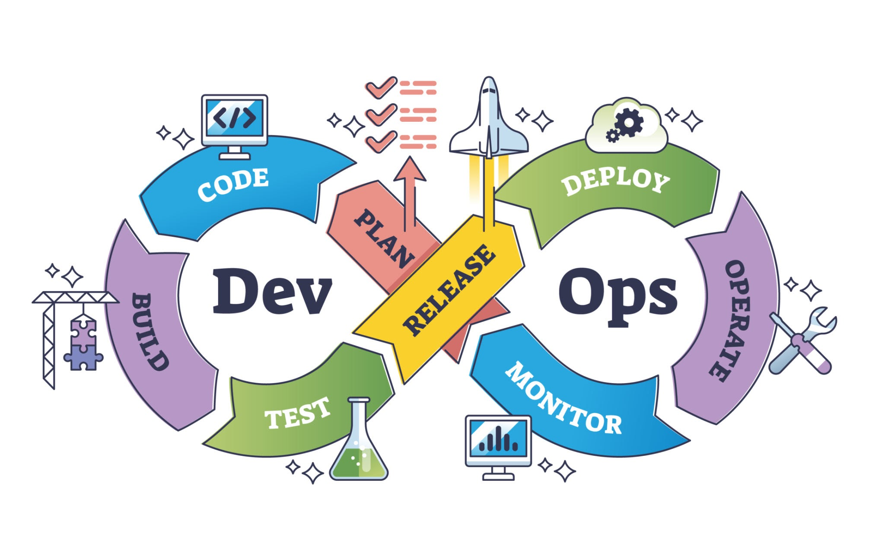

# 🚀 Engineering Dashboard: The DevOps Journey     
[DevOps Introduction](https://nitesh-dudhe.github.io/devops-journey/#/core-pillars/01-devops-intro/devops-introductions)

Welcome to my central infrastructure engineering log. This space serves as an active repository of documentation, technical deep-dives, configurations, and scripts tracking my progress through the core disciplines of cloud automation and site reliability engineering.

---

  
   
  <em style="color: #888; font-size: 0.9em; margin-top: 8px; display: inline-block;">Continuous Integration & Deployment Lifecycle</em>

---

## 🗺️ Core Pillars Roadmap

| Pillar | Core Focal Points | Progress Status |
| :--- | :--- | :--- |
| **01. DevOps Intro** | Culture, CI/CD Pipeline Lifecycles, Feedback Loops | [Explore Logs](#/core-pillars/01-devops-intro/devops-introductions) |
| **02. Linux Basics** | Kernel Spaces, Bash Scripting, SSH Hardening | [Explore Logs](#/core-pillars/02-linux-basics/linux-introduction) |
| **03. CLOUD Services** | Highly Available Infrastructure, VPC Networking, Security Policies | [Explore Logs](#/core-pillars/03-cloud-services/cloud-introduction) |
| **04. Git ➔ Jenkins** | Branching Workflows, Declarative Pipeline-as-Code | [Explore Logs](#/core-pillars/04-git-jenkins/git-workflows) |
| **05. Docker ➔ K8s** | Image Optimization, Container Lifecycles, Orchestration | [Explore Logs](#/core-pillars/05-docker-k8s/docker-mechanics) |
| **06. Terraform & Ansible** | Idempotent Infrastructure Provisioning & Configurations | [Explore Logs](#/core-pillars/06-terraform-ansible/terraform-iac) |
| **07. Bash Scripting** | System Telemetry, Automation Functions, Shell Traps | [Explore Logs](#/core-pillars/07-scripting/bash-devops) |
| **08. AI in DevOps** | ML-Powered Optimization, AIOps Platforms, Agentic Workflows | [Explore Logs](#/core-pillars/08-ai-devops/ai-devops) |
| **09. Other Tools** | Kafka | [Explore Logs](#/core-pillars/09-extra/kafka) |

---

> 📌 **Architectural Principle:** Every script, playbook, and configuration layout documented within this repository adheres strictly to standard automation practices: configuration drift prevention, absolute idempotency, and clean separation of secrets from functional code blocks.
